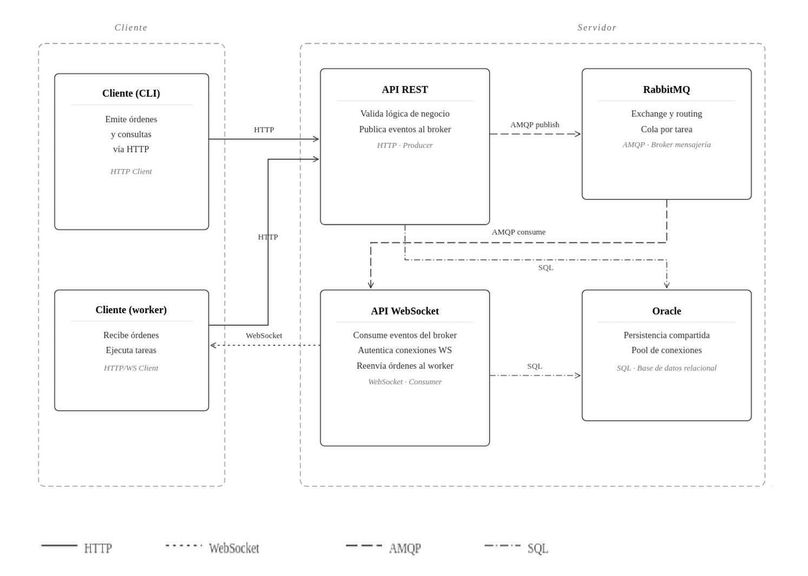

The architecture of **Synergia** is based on a centralized system for business control, transactions, and inventory, complemented by an asynchronous and decoupled load distribution model using a message broker and persistent bidirectional connections.

The system strictly separates one-off transactional operations from the continuous flow of large-scale data distribution.

---

## General Architecture Diagram

The following diagram represents the runtime services, their communication ports, protocols, and data flows between the client and server sides:

## Runtime Services

| Service | Technology | Port | Responsibility / Description |
| :--- | :--- | :--- | :--- |
| **REST API** | FastAPI + Uvicorn (`api.py`) | `8000` | Account management, authentication, control of tasks, processes, executions, payments, results downloads, and exposure of Prometheus metrics. |
| **WebSocket API** | FastAPI + aio-pika (`ws_api.py`) | `8001` | Real-time assignment of work blocks (chunks) and worker connection lifecycle control. |
| **Message Queue** | RabbitMQ | `5672` / `15672` | Persistent and asynchronous buffer. Keeps dedicated queues per task to decouple work supply from its demand. |
| **Database** | Oracle Database Free | `1521` | Full relational engine. Stores business tables, circular execution relationships, and the immutable cryptographic ledger. |
| **Monitoring** | Prometheus | `9090` | Periodic collection of operational metrics and business indicators from `/metrics` endpoints. |
| **Visualization** | Grafana | `3000` | Exposition of the operational dashboard (`synergia_dashboard.json`) for infrastructure decision-making. |
| **Network Tunnel** | ngrok | `4040` | Secure exposure of local APIs to the public network (HTTPS/WSS) for testing in development environments without a fixed public IP. |

---

## Server Design Decisions

### REST API (FastAPI)
The REST API is the logical core of the system. A REST architecture was chosen due to its natural hierarchical resource structure (for example, `/task/{id}/process/{pid}/execution/{eid}/result`) and its universal interoperability.

The API implements **18 critical functional requirements (FU-01 to FU-18)**:

* **FU-01 User registration:** Account creation with email, username, and password. Generates a confirmation email signed with a specific single-use JWT (24 hours) via SMTP.
* **FU-02 Local authentication:** Login via username or email and password, verifying credentials against **Argon2** hashes and returning a JWT signed with HS256.
* **FU-03 Authentication via OAuth2.0:** Automatic login and registration using external providers (Google and GitHub) through the *Authorization Code Flow*. Allows associating multiple providers with a single account concurrently.
* **FU-04 Query account information:** Public query of reputation, credit balance, and cryptographically linked transaction history.
* **FU-05 Task publication:** Creation of a task pointing to a public GitHub repository and its corresponding snapshot hash. The system parses the remote `config.toml` to initialize the structure.
* **FU-06 Adding entries in dynamic tasks:** Allows the publisher to inject new work blocks on the fly (`POST /task/{id}/input`) into an active dynamic task, directly filling the RabbitMQ queue.
* **FU-07 Query tasks:** Listing and filtering of tasks. Allows segmenting by tasks created by the user or tasks in which they participate as a worker (subscribed).
* **FU-08 Query progress:** Returns the real-time ratio between completed, verified, and pending items for a specific task.
* **FU-09 Task synchronization:** Allows the publisher to update the commit reference and repository integrity (SHA-256 hash) after making legitimate changes in the task's source code.
* **FU-10 State management:** Modifying the state of a task (`ACTIVE`, `PAUSED`, `CANCELLED`). Cancellation or completion empties and invalidates the corresponding queues in RabbitMQ. It is not possible to reactivate a task without a balance.
* **FU-11 Process creation:** The worker declares the start of processing of a specific chunk. Validates in advance that the range of items does not overlap with existing processes and that the worker's local integrity hash matches the task's hash exactly.
* **FU-12 Query processes:** Search and inspection of processes associated with a task, allowing to locate the exact block containing an input index.
* **FU-13 Verification execution creation:** Allows a worker node to register its intention to act as a deterministic cross-validator for a process processed by another node.
* **FU-14 Query executions:** Inspection of individual execution attempts for a process, identifying the state (success, failure, canceled, pending) of each one.
* **FU-15 Results upload:** The worker sends the resulting binary file using `multipart/form-data` along with resource consumption telemetries. Files are stored in the system using a *SHA-256 hash sharding* algorithm for automatic physical storage deduplication.
* **FU-16 Retrieval of process pending verification:** Prioritarily provides a worker with the ID of the process they must verify next, based on suspicion heuristics (reputation and cost deviation).
* **FU-17 Results download:** Streaming download of a dynamically packaged ZIP with all valid results (filterable by `?canonical_only=true`).
* **FU-18 Metrics exposure:** Endpoint exposed at `/metrics` in native Prometheus format for infrastructure time series.

### WebSocket API (FastAPI)
The WebSocket API handles continuous data consumption. A bidirectional socket communication API was designed for three critical reasons:
1. **Avoiding direct exposure of RabbitMQ:** Client nodes do not talk directly to the broker. This eliminates the need for complex individual RabbitMQ credential management per user and removes a potential attack surface.
2. **Connectivity control (Native Heartbeat):** The WebSocket protocol performs automatic pings and pongs. If the client experiences an abrupt physical disconnection or crash, the WebSocket API detects it instantly, revokes orphaned processes, and issues a **NACK (Negative Acknowledgement)** to RabbitMQ to re-queue work in flight without data loss.
3. **Workflow Control (Backpressure):** Allows the worker to adjust its consumption capacity using the `n_consumes` flag.

### RabbitMQ (AMQP)
RabbitMQ acts as the asynchronous buffer that decouples work publication from consumption. A **Direct** exchange is used (with routing key `task_{id}`) along with queues declared as **Durable** to ensure resilience against broker crashes.

:::note[Why not use Apache Kafka?]
Kafka is optimized to process massive event streams (logs) in a strictly sequential manner using prolonged storage. Synergia requires **fine-grained control per individual message**: selective acknowledgement, re-queueing on worker failure, and non-linear dynamic consumption. RabbitMQ natively fits this pattern of work queues (*competing consumers*).
:::

:::note[Why not use Redis?]
Redis prioritizes ultra-low latency in-memory access and lacks built-in reliable per-message acknowledgements with native transactional persistence, forcing developers to write complex Lua scripts to emulate robust queues.
:::

### Database (Oracle Database Free)
The relational database guarantees the global consistency of the system.

#### SERIALIZABLE Isolation Level
The connection pool was configured to the strictest transaction isolation level: **SERIALIZABLE**. 
In a concurrent environment, changing the canonical result of a process involves reversing the credit balance of the former worker and transferring credits to the new worker in parallel. A lower isolation level (such as *Read Committed*) would allow two concurrent transactions to read the same state and trigger race conditions (double payment or financial imbalance of network credits). `SERIALIZABLE` prevents dirty, phantom, or non-repeatable reads by forcing the absolute mathematical consistency of the platform's internal economy.

#### Oracle's Blockchain Tables
The database engine was migrated to Oracle Database to natively leverage its **Blockchain Tables**. These tables are immutable ledgers where each row contains a cryptographic hash linked to the previous row using **SHA2-512** (see the [Data Model](../modelo-de-datos/) section). This protects the transactional credit history from internal tampering (even by administrative users with direct database access).

---

## Client Design Decisions

The CLI client (`synergia-client`) is designed as a modular, packaged Python package for easy distribution, acting under two roles:

### User CLI
* Centralizes human interactions: login, task creation, dynamic inputs injection, and downloads.
* Stores active sessions locally in `~/.cn_profile.json` (JWT) and physical configuration in `~/.cn_device.json`.
* **Execution-free publication:** The publisher can compile and publish a task by calculating its local integrity hashes without needing heavy physical resources (e.g., GPU) to run it.

### Scheduler
The scheduler (`start-scheduler`) automates subscription to multiple queues and offers two advanced operating modes to coordinate hardware:

* **Round-Robin Mode:** The node connects to a queue, processes a block of `N` chunks (default 5), commits the work, rotates to the next subscribed task, and repeats the process sequentially. This prevents starvation of small tasks on nodes with a single worker.
* **Split Mode (Core Division):** The scheduler reads the total available cores in `~/.cn_device.json`, divides the threads equally among all active subscribed tasks, and spawns independent worker processes that consume and execute in parallel concurrently.
