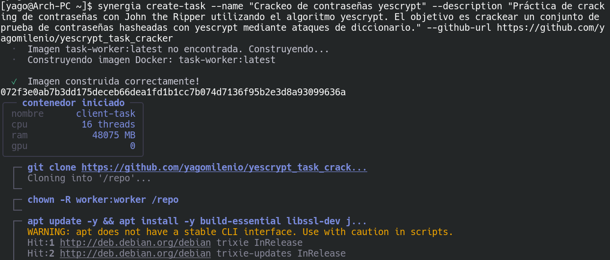
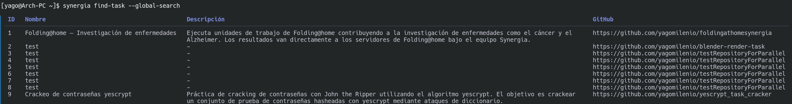
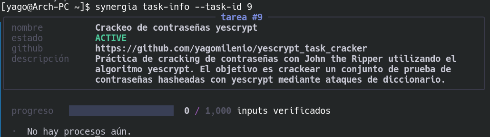
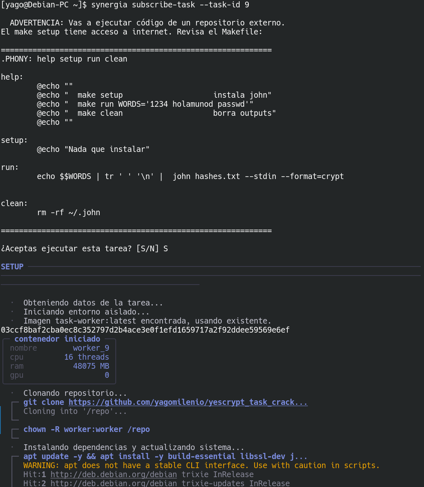
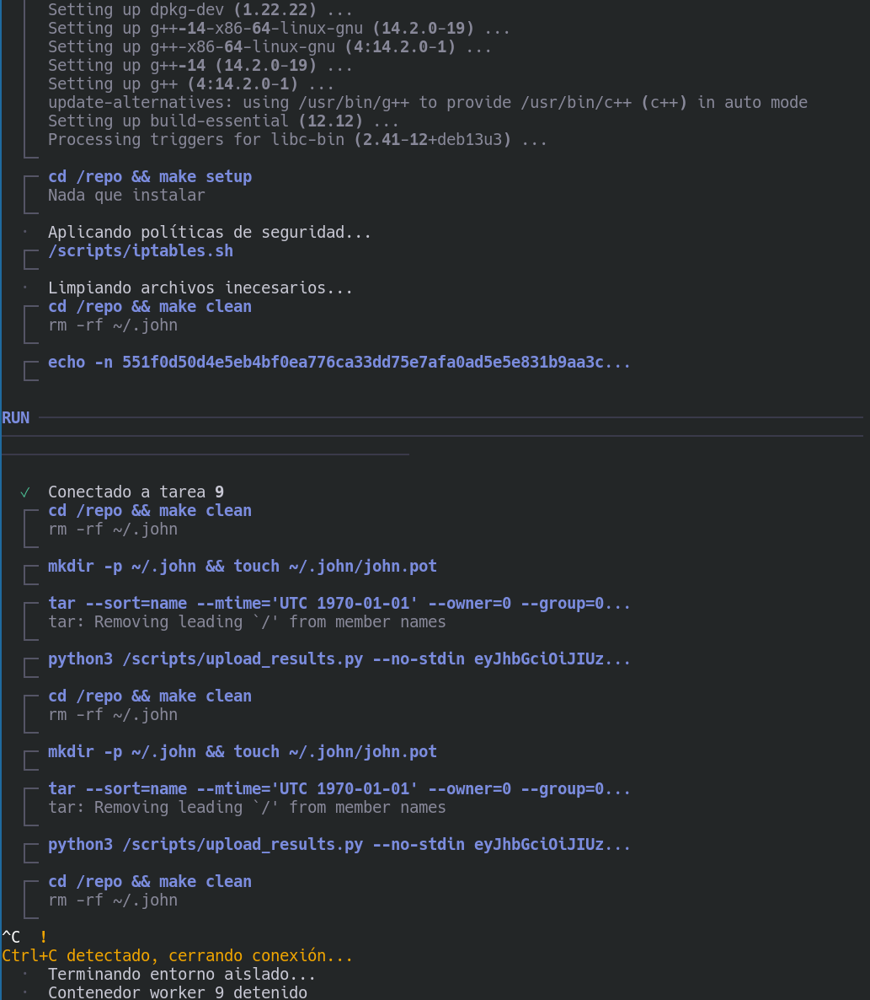
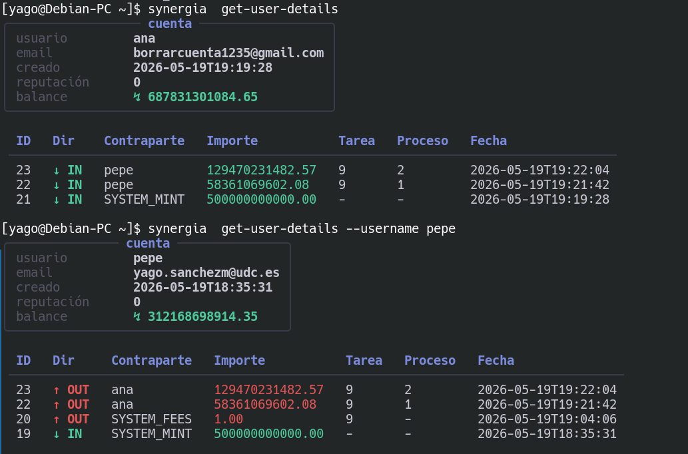
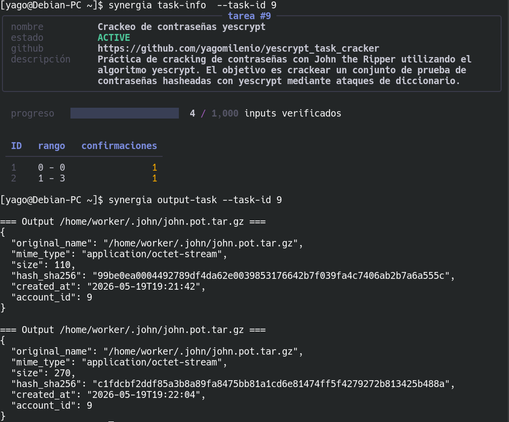
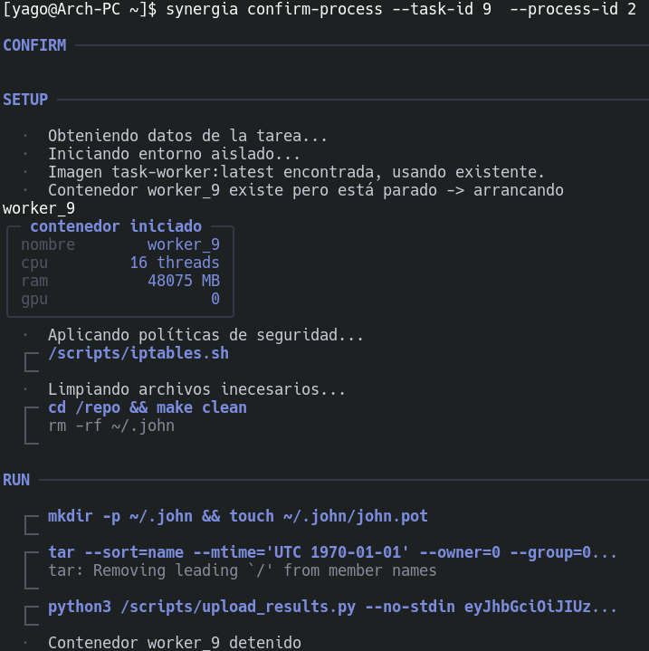
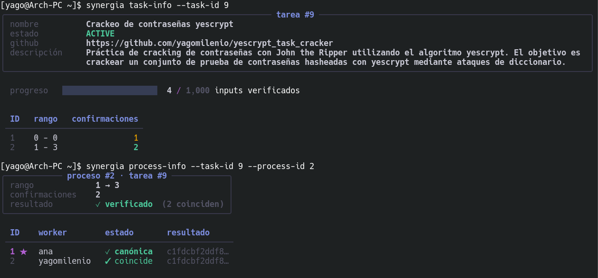
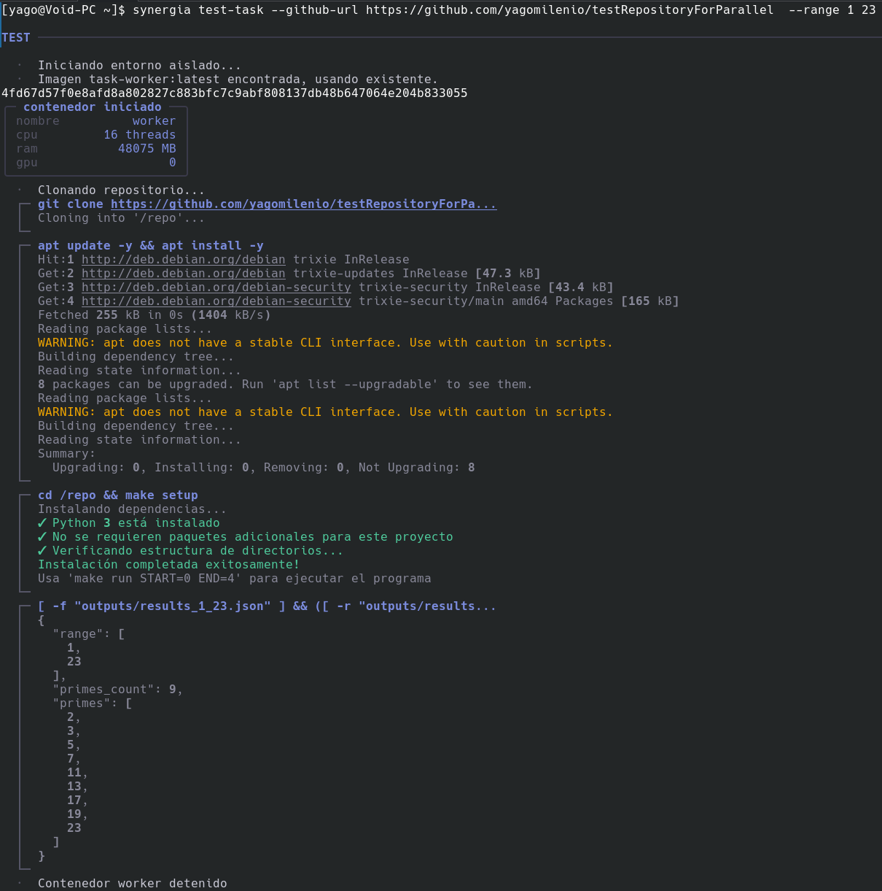

This scenario documents the most representative flow of the platform: a user publishes a task and another user processes it as a worker, earning credits in return. The example task `yescrypt_task_cracker` is used, which attempts to crack a list of passwords using a dictionary with John the Ripper (see [Example Tasks](../tareas-ejemplo/)).

The scenario involves two actors: the user **Pepe** acts as the publisher, and the user **Ana** acts as the worker. Both accounts have a sufficient balance to operate. At the end of the flow, we verify that the balances of both accounts correctly reflect the transfers made and that the results are downloadable.

---

## Step 1 — Task Publication by Pepe

The publisher runs the publication command, specifying the GitHub repository URL and the name that will be visible on the platform:

```bash
synergia login-user --username pepe --passwd ********
synergia create-task --name "Crackeo yescrypt" --github-url https://github.com/yagomilenio/yescrypt_task_cracker
```



The system parses the repository's `config.toml` file to determine the number of entries, calculates the corresponding block size, and creates the queue in RabbitMQ. Pepe's balance decreases by the fixed publication cost. As a result of the task creation command, the assigned identifier is returned.

## Step 2 — Viewing the Available Tasks List

From Ana's account, the list of active tasks on the platform is queried. The newly published task by Pepe should appear with an `ACTIVE` status and the basic information of the associated repository:

```bash
synergia find-task --status ACTIVE
synergia task-info --task-id 1
```



`task-info` shows more details about the task: status, progress, and repository information:



## Step 3 — Ana's Subscription as a Worker

The worker Ana subscribes to the task. The system displays the repository's `Makefile` before confirming the subscription, so she can review it and verify that the code is legitimate:

```bash
synergia subscribe-task --task-id 1
```



After confirming, the client downloads the assigned block from the queue, runs the Docker container, and processes the associated entries. Both the `SETUP` and `RUN` processes defined in the `Makefile` can be observed in the client's output (see [Makefile Contract](../contrato-makefile/)):



## Step 4 — Verifying Balances After Processing

Once the results are uploaded, the balances of both accounts are checked to verify that the transfer was performed successfully:

```bash
synergia get-user-details --username pepe
synergia get-user-details --username ana
```



Pepe's balance will have decreased by the amount calculated by the credit formula, and Ana's will have increased by that same value (see [Cost Calculation Formulas](../modelo-economico/#fórmulas-de-cálculo-de-coste-de-ejecución)).

## Step 5 — Downloading Results

The server packages the output files into a `gzip`-compressed `zip` archive and serves it as a response:

```bash
synergia output-task --task-id 1 --download
```



:::tip[Results are public]
Results can be retrieved from any authenticated account on the platform, not just Ana's — any user can access the results of any published task. This fosters transparency.
:::

By querying the task status again, you can see the total number of processed entries and the processes generated during execution. For instance, two processes might have been created: one that processed a single entry and another that processed several, showcasing the dynamic adjustment of process sizes. This concept should not be confused with block sizes, which are managed at the RabbitMQ queue level (see [Glossary](../glosario/)).

When a process groups multiple entries, the resulting data is concatenated into a single output file.

## Step 6 — Confirming the Assigned Process

Since no updates were made between the task processing and its confirmation, no warnings regarding a repository commit change relative to the currently imported one are shown:

```bash
synergia confirm-process --task-id 1 --process-id 1
synergia process-info --task-id 1 --process-id 1
```



Once completed, the details of the confirmed process can be queried: the canonical value, the result hash, and the information of the users who processed and confirmed it:



---

## Validating a Task Before Publishing

Before publishing your own task, it is advisable to validate that it is correctly defined. The validation system checks the structure, configuration, and consistency of the defined parameters, in addition to executing the task with a sample input element if required:

```bash
synergia test-task --github-url https://github.com/user/mi-tarea --word "entrada de prueba"
synergia test-task --github-url https://github.com/user/mi-tarea --range 0 10
```



:::note[Limitation]
To validate the complete execution flow, the user publishing the task must have the ability to run it locally — only then can run-time behavior be verified. Otherwise, it is only possible to validate static configuration aspects, without being able to detect potential runtime errors. This allows developers to validate the execution logic and input processing independently before exposing the task to the network.
:::
