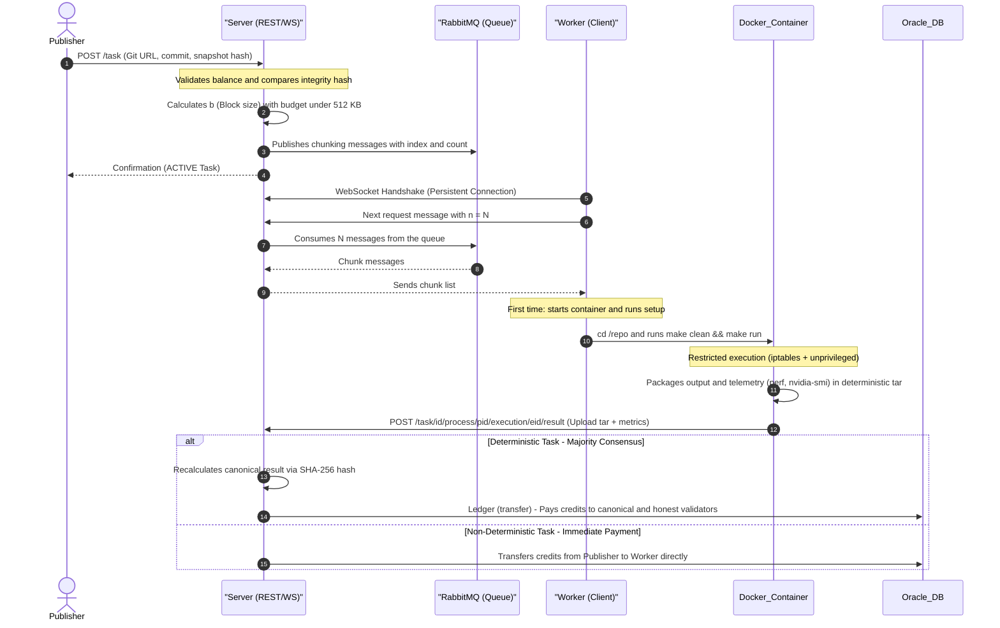
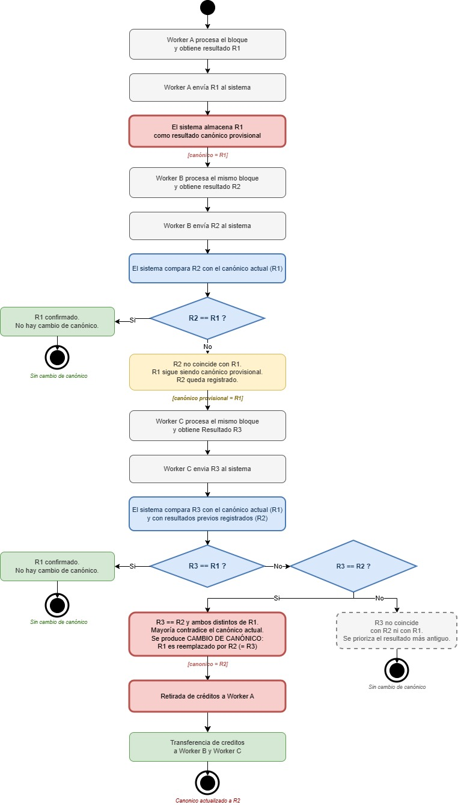
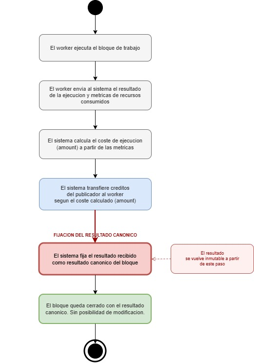

The operational lifecycle of a task in Synergia comprises five decoupled sequential phases: **Publication**, **Chunking (Segmentation)**, **Distribution**, **Local Execution**, and **Verification with Settlement**.

---

## Workflow Diagram

The following diagram details the complete lifecycle of a work block (chunk) and the interactions between components:



---

## Publication Phase

The process begins when a **Publisher** invokes the `synergia create-task` command. The CLI client performs the following local preparatory steps:
1. Applies exclusions defined in the `[hash].exclude` section of `config.toml`.
2. Calculates the SHA-256 integrity hash of the local repository in its current state (`repo_snapshot_hash`).
3. Sends task metadata, public GitHub URL, current commit, and snapshot hash to the server (`POST /task`).

On the server:
1. The repository is temporarily cloned, and `load_config()` is executed. The parser extracts the configuration and input properties defined in `config.toml` (total number of items).
2. It is verified that the Publisher has a sufficient balance in their account to cover the fixed publication cost `TASK_COST` (defined in `config.json`).
3. An immutable transfer of credits is made from the publisher's account to the system fee account (`SYSTEM_FEES`).
4. Task cost statistics are initialized in the database (mean and variance set to zero).
5. Work blocks (*chunks*) are created and published to RabbitMQ.

---

## Advanced Segmentation (Chunking on the Producer)

For tasks with millions of inputs (such as a cryptographic dictionary of billions of words), filling RabbitMQ queues with an individual message per item would saturate the servers' RAM. To solve this, the server groups inputs into blocks (chunks) of size b.

The Synergia producer seeks to **minimize block size b** (to allow work to be distributed in the smallest possible pieces among workers) while ensuring that **the cumulative size of the entire queue in RAM does not exceed 512 KB** (`maxima_memoria = 512 * 1024` bytes).

### AMQP Protocol Overhead and JSON Payload
Each JSON message has the structure `{"index": X, "count": b}`. The cost in bytes of the k-th message with starting index k × b is:

<pre class="math-formula-box">
s(k) = K + d(k × b) + d( min(b, N - k × b) )

Where:
* K  = 25 bytes (AMQP overhead + JSON)
* d(n) is the number of digits of an integer n in base 10:
  d(0) = 1
  d(n) = trunc( log10(n) ) + 1    (if n >= 1)
</pre>

### Constant Time Estimation Algorithm: O(log10 N)
The naive solution consists of a loop that sums the sizes of all messages, which would cause a CPU timeout lock on the server for massive tasks.

To solve this, Synergia implements a **mathematical estimation algorithm in O(log10 N) time** that divides the index space by digit spans. Below is the actual code from `publisher.py` that recursively calculates the required queue memory without iterating element by element:

```python
# src/publisher.py (Actual memory estimation code)
import math

def memoria_total(start, end, step):
    OVERHEAD_AMQP = 3   # AMQP adds 3 extra bytes of overhead to the payload
    base = len('{"index":,"count":}') + OVERHEAD_AMQP
    n = math.ceil((end - start) / step)
    
    # Sum of digits of all start_index and end_index without iterating
    suma_start = suma_digitos_secuencia(start, end, step)
    suma_end   = suma_digitos_secuencia(start + step, end + step, step)
    
    return n * base + suma_start + suma_end

def suma_digitos_secuencia(start, end, step):
    """Sums len(str(x)) for x in range(start, end, step) without performing sequential iterations"""
    total = 0
    # d-digit numbers range from 10^(d-1) to 10^d - 1
    for digitos in range(1, len(str(end)) + 2):
        tramo_ini = max(start, 10**(digitos-1))
        tramo_fin = min(end,   10**digitos)
        if tramo_ini >= tramo_fin:
            continue
        # How many step values fall within this range
        count = math.ceil((tramo_fin - tramo_ini) / step)
        total += count * digitos
    return total
```

### Block Size Optimization
The producer initializes the segmentation with a block size of $b=1$. If the `memoria_total` estimation exceeds the budget limit of **512 KB**, the server proportionally recalculates the optimal block size by applying an analytical rule of three:

```python
# src/publisher.py (Actual block size optimization code)
def generate_chunks(self, task_id, n_inputs: int):
    chunks = []
    start_index = 0
    chunk_size = 1
    maxima_memoria = 512*1024  # 512KB RAM limit in RabbitMQ
    
    memoria_requerida = memoria_total(start_index, n_inputs-1, chunk_size)
    
    # Optimization loop: converges immediately
    while memoria_requerida > maxima_memoria:
        # Analytical rule of three for required vs max memory
        nuevo_chunk_size = int(chunk_size * memoria_requerida / maxima_memoria)
        chunk_size = max(chunk_size + 1, nuevo_chunk_size)  # Avoid infinite loops
        memoria_requerida = memoria_total(start_index, n_inputs-1, chunk_size)

    # Fill the queue with the optimized chunk distribution
    while start_index < n_inputs:
        count = min(chunk_size, n_inputs - start_index)
        chunks.append({
            "index": start_index,
            "count": count
        })
        start_index += count

    return chunks
```
This algorithm converges in an average of **2 to 3 iterations** even for datasets of 10⁹ items, guaranteeing ultra-fast and secure publication for the RabbitMQ server.

---

## Subscription and Consumption Phase (WebSocket)

The worker opens a persistent bidirectional connection to `/ws/task/{task_id}`.
* It sends a `{"action": "next", "n": N}` message to indicate its availability to process up to N blocks in parallel.
* The WebSocket server, communicating with RabbitMQ asynchronously via `aio-pika`, consumes these messages.
* The system applies a **Backpressure** mechanism by coupling the AMQP prefetch parameter (`prefetch_count`) to the `n` value specified by the client. This avoids saturating the worker with local network buffers.
* Consumed messages remain in an "unacknowledged" state in RabbitMQ. If the worker finishes successfully in the database, the server sends a definitive `ack` to delete the chunk. If the worker crashes, the socket disconnection triggers an automatic `nack`, re-queuing the chunk for other nodes.

---

## Local Execution Phase (Worker)

The worker runs a continuous automated local processing loop:
1. **Synchronization:** Checks if the local snapshot hash matches the server's.
2. **Isolated Environment:** If it is the first block, it spins up the Docker container and invokes the `make setup` target in the shared `/repo` directory (see [Security](../seguridad/)).
3. **Resource Download:** Downloads external data files specified in the `[download]` directive of `config.toml`.
4. **Network Traffic:** Applies firewall restrictions blocking all traffic except to authorized domains in `[network].allowed_hosts`.
5. **Chunk Execution:** Cleans up remnants of previous executions with `make clean` and invokes `make run` by injecting associated environment variables (e.g., `START=... END=...`).
6. **Physical Metrics:** During execution, the process is monitored using `perf stat` to capture CPU cycles, and via `nvidia-smi` for GPU telemetry (watts consumed, VRAM memory).
7. **Deterministic Packaging:** Upon completion, the directory specified in `[outputs]` is packaged deterministically to avoid binary differences due to file metadata:
   ```bash
   tar --sort=name --mtime="1970-01-01 00:00:00Z" --owner=0 --group=0 --numeric-owner -czf resultado.tar.gz -C outputs/ .
   ```
8. **Upload:** Performs a POST with the binary package and resource consumption to `/task/{id}/process/{pid}/execution/{eid}/result`.

---

## Verification and Payment Phase (Consensus)

When a result is uploaded, the server determines the validity of the work:

### Deterministic Tasks
They trigger cross-verification by consensus.
1. The **canonical result** is calculated: the result file hash (`result_file_id`) with the majority of matching `SUCCESS` executions. In case of a tie, the oldest execution prevails.
2. **Canonical Shift:** If the new result alters the previously existing canonical consensus, the server **reverts the payment** to the old worker suspected of fraud (reclaiming credits from their account and reducing their reputation) and transfers the full payment to the new legitimate canonical worker from the Publisher's balance.
3. **Canonical Confirmation:** If the new result matches the existing canonical one, the validator worker receives a fraction of confirmation incentive from `SYSTEM_FEES`.



### Non-Deterministic Tasks
They do not support mathematical dispute (e.g., stochastic simulations). The first correct result uploaded is automatically accepted, and the worker collects 100% of the credits directly from the Publisher's balance.



---

## Closure and Debt Control (Welford's Algorithm)

Synergia allows controlled negative credit balances (accounting debts) to prevent the network from stalling mid-execution of a heavy block. However, to prevent systematic fraud and accumulation of non-payments, the server dynamically calculates the estimated cost of the next chunk for each task.

### Cost Estimation with O(1) Complexity
The cost per item of each process i with total cost c_i and processed items k_i is defined as x_i = c_i / k_i. The server incrementally calculates the **cumulative mean** and the **variance/standard deviation** of the cost per item using **Welford's algorithm**.

This algorithm is numerically stable and allows updates after each process with a time complexity of **O(1)** without the need to store the entire history or perform heavy database re-scans of O(n) complexity:

<pre class="math-formula-box">
SS_i  = SS_{i-1} + (x_i - mean_{i-1}) × (x_i - mean_i)
mean_i = mean_{i-1} + (x_i - mean_{i-1}) / i
sigma_i = sqrt( SS_i / i )

Estimated Cost = (mean_i + sigma_i) × k
</pre>

If the Publisher's free balance falls **below the Estimated Cost of the next block**, the server **automatically pauses all its active tasks** and empties its RabbitMQ queues, preventing the injection of new debts to the network's workers.
