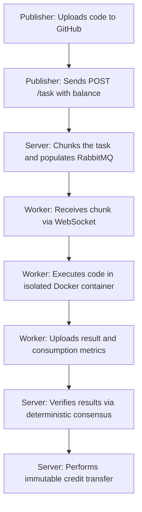

**Synergia** is a voluntary, centralized distributed computing platform designed to democratize access to computing power. It allows any user to publish computationally expensive tasks in the form of GitHub repositories and delegate their processing to a heterogeneous network of voluntary nodes (**workers**), guaranteeing an isolated, secure environment with cross-verified results.

In exchange for contributing their hardware resources (CPU, RAM, GPU), workers accumulate **internal credits** proportional to the actual computational cost incurred. These credits can subsequently be used to publish their own tasks, creating a circular economy of direct computing power exchange without the need to rent expensive cloud infrastructure.

---

## Motivation

In recent years, the cost of hardware components, both for personal computers and dedicated servers, has increased significantly. An example of this is the rising cost of graphics cards during the pandemic, driven by chip shortages. Another relevant example is the growing cost of RAM memory currently observed, fueled by the intensive demand that artificial intelligence systems place on this component.

This situation leaves a large portion of users in a position where the only viable access to computing power is through paid platforms such as Amazon Web Services, Microsoft Azure, or Google Cloud. However, globally, a vast number of personal computers are in operation, and the market continues to grow steadily.

Despite this, various studies indicate that a substantial portion of the computational resources available in personal computers remains underutilized for much of their lifecycle: it has been observed that between 40% and 60% of processing capacity is idle. This situation highlights the existence of a massive amount of wasted computing capacity.

Synergia proposes a centralized but distributed platform that allows users to process published tasks in exchange for certain incentives, managed by an internal monetary system that enables computing exchange. In this way, users who lack specific hardware components (such as graphics processing units) have the opportunity to access specialized computational resources in exchange for contributing the computing capacity they do have. Furthermore, unlike other platforms, this solution does not require users to configure their own infrastructure or deploy additional services to publish tasks, significantly lowering the technical barrier to entry.

---

## Roles in the System

The Synergia ecosystem is defined by the interaction of three main roles, which a single user can alternate according to their needs:

1. **Publisher:**
   * The creator or owner of the task.
   * Publishes the task to the network by pointing to a public GitHub repository (`POST /task`).
   * Funds the execution of their task via a deposit of credits (paying a fixed publication fee `TASK_COST` and the processing cost of each block).

2. **Worker:**
   * The node that offers its idle computing power.
   * Subscribes to active tasks and consumes work blocks (*chunks*) via a persistent WebSocket channel.
   * Executes the task's code locally inside a strictly isolated Docker container.
   * Uploads computed results and consumption metrics to receive credits.
   * Does not choose which task to process arbitrarily: they subscribe to specific tasks, and the system assigns them blocks based on input availability. By default, all accounts are subscribed to the system's main task; for other tasks, every time a subscription order is executed, the user is warned to review the repository, showing them the task's Makefile before confirmation.

3. **Server (Backend):**
   * Acts as the central orchestrator, queue manager, and financial ledger.
   * Validates the integrity of the repository's code, manages message flow in RabbitMQ, and processes credit transactions.
   * Implements consensus verification logic to prevent fraudulent results.

:::tip[What if I publish and process my own task?]
A single user can play both the publisher and worker roles for the same task, processing a task they created themselves. In that case, both outgoing and incoming transactions are still generated on the same account, resulting in a net profit of zero.
:::

### Internal System Accounts

In addition to user accounts, the platform maintains a set of internal accounts used to manage the network economy. None of these accounts are directly accessible by users:

| Account | Function |
|---|---|
| `mint` | Issues initial credits to new users registering on the platform. |
| `fees` | Receives the publication cost of each task and pays rewards to workers who confirm canonical results. |

A direct example of how this works is the payments for the system's genesis task (see [Economic Model](../modelo-economico/#el-arranque-en-frío-y-la-tarea-génesis)): in that case, the publisher is an internal account that makes all payments and has an inexhaustible balance.

---

## Project Organization

The platform is implemented modularly across two major independent components residing in separate repositories:

* **`synergia-server` (Backend):**
  * **REST API:** Written in FastAPI, handles specific operations (account management, login, task publishing, result downloads, monitoring, and metrics).
  * **WebSocket API:** High-speed, low-latency service for real-time block assignment and consumption, directly connected to RabbitMQ.
  * **Database:** Oracle Database Free, used for complete relational modeling and the immutable cryptographic ledger.
  * **Deployment Infrastructure:** Docker Compose, Prometheus, and Grafana configurations for operational monitoring.

* **`synergia-client` (CLI Client and Worker):**
  * **CLI Tool (`synergia`):** Command-line tool packaged in Python to manage accounts, configure local hardware resources, publish tasks, and manage subscriptions.
  * **Internal Worker:** Daemon that automates repository downloading, setting up isolated environments in Docker, executing the Makefile, and uploading result files.
  * **Scheduler:** Planning system (round-robin or core-splitting) to run multiple tasks in the background.

---

## Basic Operational Flow

The basic operational cycle of Synergia follows a closed loop:

The following sections detail the deep technical aspects of the architecture, isolation security, the exact economic model, and the system reference guide.
