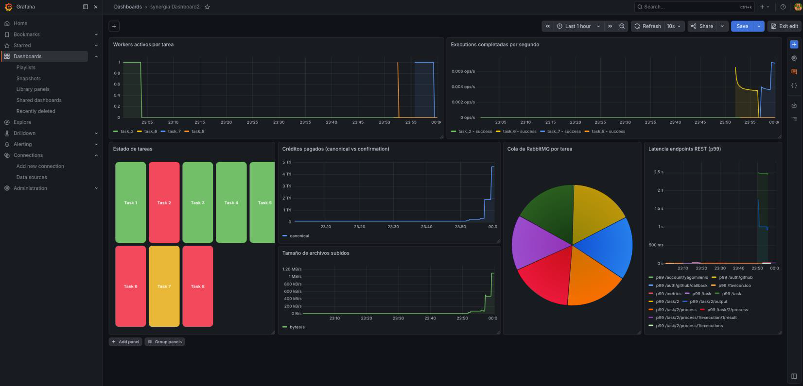

Observability is a fundamental component for monitoring network health, auditing internal economic transfers, tracking API latency, and diagnosing worker workload distribution.

Synergia implements natively integrated telemetries in its REST and WebSocket APIs by exposing the `/metrics` endpoint in structured format to be periodically scraped by **Prometheus**.

---

## Prometheus Metric Catalog

The server exposes the following business and infrastructure time-series variables:

| Metric | Type | Labels | Service | Description |
| :--- | :--- | :--- | :--- | :--- |
| **`p2pcn_active_workers`** | Gauge | `task_id` | REST + WS | Real-time number of worker nodes with active persistent WebSocket connections on each task. |
| **`p2pcn_executions_created_total`** | Counter | `task_id` | REST | Cumulative counter of initialized execution attempts (new blocks consumed). |
| **`p2pcn_executions_completed_total`** | Counter | `task_id`, `result` | REST | History of completed executions. The `result` label allows breakdown by `success`, `failed`, `cancelled`, or `verification`. |
| **`p2pcn_payments_total_amount`** | Counter | `type` | REST | Total volume of credits distributed across the network, broken down by payment flow label (`canonical`, `canonical_change`, or `confirmation`). |
| **`p2pcn_upload_size_bytes`** | Histogram | — | REST | Size distribution of binary result files uploaded to the platform (buckets spanning 1 KB to 10 MB). |
| **`p2pcn_request_duration_seconds`** | Histogram | `method`, `endpoint` | REST | Response latency and performance profile of individual HTTP endpoints (FastAPI). |
| **`p2pcn_task_status`** | Gauge | `task_id` | REST | Current numerical status of the task mapped in the database (`ACTIVE=1`, `PAUSED=2`, `CANCELLED=3`, `COMPLETED=4`). |
| **`p2pcn_process_status`** | Gauge | `task_id`, `process_id`, `status` | REST | Individual status of each process in flight in the RabbitMQ queue. |

---

## Prometheus Configuration

The Prometheus service runs under Docker Compose and is parameterized via the infrastructure configuration file `infra/monitoring/prometheus/prometheus.yml`.

Prometheus periodically queries (by default every 15 seconds) the REST and WebSocket API endpoints:

```yaml
# infra/monitoring/prometheus/prometheus.yml (Actual schema)
global:
  scrape_interval: 15s

scrape_configs:
  - job_name: 'synergia-rest-api'
    static_configs:
      - targets: ['rest_api:8000']

  - job_name: 'synergia-ws-api'
    static_configs:
      - targets: ['ws_api:8001']

  - job_name: 'rabbitmq'
    static_configs:
      - targets: ['rabbitmq:15692'] # RabbitMQ native metrics
```

---

## Grafana Dashboard

To view these telemetries in a unified way and facilitate administration of the network, Synergia includes a complete preconfigured dashboard template in Grafana, located at:

`infra/monitoring/dashboards/synergia_dashboard.json`

Once the infrastructure is started with Docker Compose and upon accessing Grafana (port `3000`), the administrator will have interactive panels graphically monitoring:

* **Active Workers:** Line graphs showing the volume of concurrent connections segmented by task.
* **Completion Rate:** Success rate pie charts versus failed or cancelled executions, useful for identifying bugs or instability in specific Makefile code.
* **Economic Distribution:** Graphical record of the cumulative volume of credits transferred between publishers and validators.
* **Queue Monitoring:** Instantaneous message count in RabbitMQ queues, detecting processing bottlenecks.
* **Inference/Computation Times:** Average latency in seconds that workers take to solve assigned chunks.

:::tip[Operational Dashboard]
Below is an actual screenshot of the unified monitoring panel in Grafana, showing computational consumption peaks, block processing success rates, global credit balances, and RabbitMQ health status:


:::
