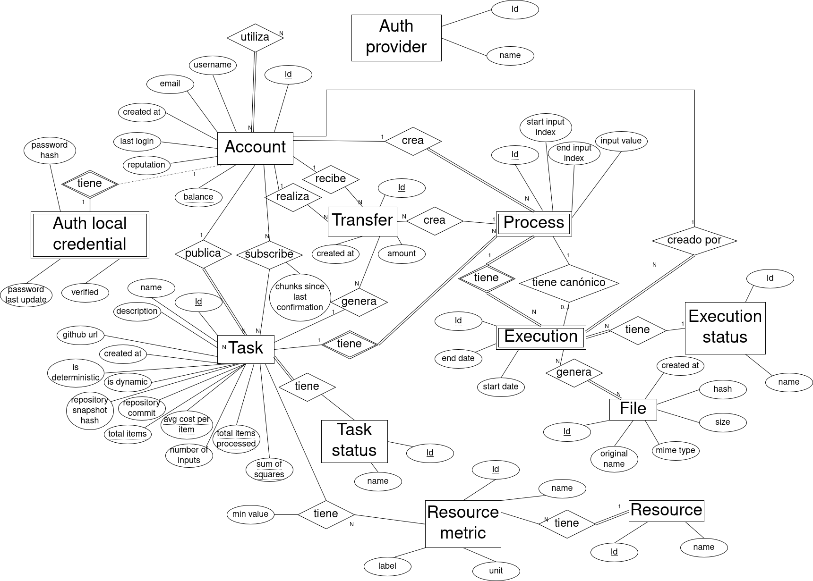

The Synergia backend entrusts its persistence to **Oracle Database Free**, modeling a strict relational schema of thirteen tables that guarantees global ACID consistency and the absolute immutability of economic and reputational information.

---

## Catalog and Purpose of the Tables

The relational schema of Synergia divides the business domain into four logical subsystems: **Accounts and Authentication**, **Physical Resources**, **Tasks and Processing**, and **Financial History**.

| Table | Subsystem | Purpose and Description |
| :--- | :--- | :--- |
| `account` | Accounts | Stores user profile (`username`, `email`, `reputation`, `balance`). Contains reserved system accounts: `SYSTEM_MINT` (initial credit creation) and `SYSTEM_FEES` (publishing and verification fees). |
| `auth_provider` | Accounts | Fixed catalog of authorized identity providers (`LOCAL`, `GOOGLE`, `GITHUB`). |
| `auth_provider_account` | Accounts | Associative table mapping which accounts in `account` are linked to which providers in `auth_provider`, along with their unique remote identifier. |
| `auth_local_credential` | Accounts | Local login credentials: password hash calculated with **Argon2** and the binary email verification flag. 1:1 relationship with `account`. |
| `resource_type` | Resources | Catalog of monitored physical computational resource types (`CPU`, `GPU`, `RAM`). |
| `resource_metric` | Resources | Definition of physical resource pricing constants (cost profiles per cycle, GB, or watt). |
| `task` | Tasks | Each published task: repository URL, current commit, snapshot hash, status, and cumulative telemetries of Welford's incremental algorithm. |
| `resource_task` | Tasks | Maps which resources (CPU, GPU, or RAM) are actively consumed by a task. |
| `task_requirement` | Tasks | Minimum physical hardware requirements specified by the publisher for a worker to subscribe (e.g., `min_ram_mb=2048`). |
| `task_subscription` | Tasks | N:M relationship registering which workers are subscribed to which tasks, along with the `chunks_since_last_verification` counter to force audits. |
| `process` | Processing | An assigned processing block (*chunk*) of a task. Contains the range `[input_start_index, input_end_index]` (or the dynamic `input_value`) and points to its accepted canonical execution. |
| `execution` | Processing | Individual physical execution or attempt performed by a specific worker on a process. Maintains cycle state (`PENDING`, `SUCCESS`, `FAILED`, `CANCELLED`). |
| `result_file` | Processing | Physical metadata of the binary result file saved on the server, indexed by its SHA-256 hash for physical file deduplication. |
| `transfer` | Financial | Immutable ledger. Records every movement of credits between accounts in the network. |

---

## Entity-Relationship Diagram

Below is the global entity-relationship diagram of the system, detailing the thirteen tables of the Oracle DB persistence model and their referential integrity constraints:



---

## Circular Foreign Keys in Processing

A notable aspect of the system's relational design is the bidirectional and circular relationship established between the `process` and `execution` tables.

### Design Justification
1. A **process** (work chunk) can be executed redundantly by multiple different workers to perform cross-verification. Therefore, a process has a **1-to-N** relationship with **executions** (`execution.process_id` points to `process.id`).
2. At the same time, after applying majority hash consensus, the process must record which of those attempts was accepted as the official correct result of the network. For this, the `process` table has the `canonical_execution_id` field that points back to the winning execution in `execution`.

:::warning[Transaction Management]
These circular foreign keys require strict control during record creation and deletion. When registering the first execution of a new process, the `canonical_execution_id` field in `process` is initialized as `NULL`. Once consensus is calculated after uploads, the server performs a transactional `UPDATE` to link the ID of the winning execution.
:::

---

## The `transfer` Table: An Immutable Ledger (Blockchain Table)

The economic integrity of Synergia resides in the immutability of its transactions. To prevent a malicious administrator with root privileges on the server from modifying an account's credit balance by altering old SQL records, the `transfer` table is declared as an **Oracle Blockchain Table**.

### SQL Creation Statement
The table is defined in the database engine with cryptographic constraints and active retention policies at the kernel level:

```sql
CREATE BLOCKCHAIN TABLE transfer (
    id NUMBER(19) NOT NULL,
    from_account_id NUMBER(19) NOT NULL,
    to_account_id   NUMBER(19) NOT NULL,
    task_id NUMBER(19), 
    process_id NUMBER(19),
    amount NUMBER(20,4) NOT NULL,
    created_at TIMESTAMP DEFAULT CURRENT_TIMESTAMP NOT NULL,
    CONSTRAINT pk_transfer PRIMARY KEY (id)
)
NO DROP UNTIL 31 DAYS IDLE
NO DELETE LOCKED
HASHING USING "SHA2_512" VERSION "v1";
```

### Security Properties of Blockchain Tables

1. **Row Immutability (`NO DELETE LOCKED`):** No row inserted into the `transfer` table can ever be deleted by any `DELETE` or `TRUNCATE` statement, not even by the database administrator user (`SYS`/`SYSTEM`).
2. **Structure Protection (`NO DROP UNTIL 31 DAYS IDLE`):** Prevents deleting or dropping the complete table unless the database detects that the platform has remained inactive (no new insertions) for a minimum period of 31 days.
3. **Cryptographic Chaining (`HASHING USING "SHA2_512"`):** Each time a credit transfer is added (e.g., a task payment), the database automatically calculates a **SHA2-512** hash that concatenates the field contents of the new row with the hash of the previous row. If someone attempted to modify a byte in the physical storage of the hard drive, the chain signature would break instantly, invalidating the ledger.

### Impact on the REST API (Prohibition of `FOR UPDATE`)
Since Blockchain Tables implement a strictly consistent insert-only model, **they do not support mutational row locks**.

For this reason, queries in the Synergia REST API that read the `transfer` table to calculate balances or transactions **never use the `FOR UPDATE` SQL directive**. Attempting to execute a mutational lock on immutable cryptographic records would trigger an explicit rejection error from the Oracle engine. Concurrency control is resolved by elevating the transactional isolation of the backend to **SERIALIZABLE**.
