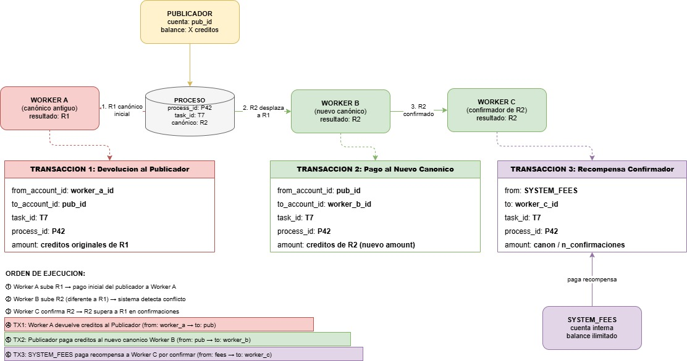
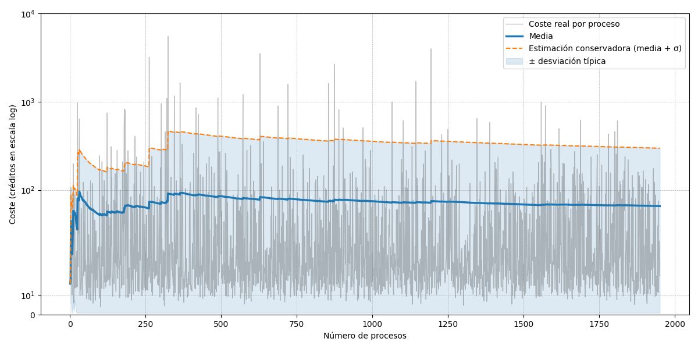

Synergia incorporates a closed economy of direct hardware resource exchange based on a virtual token called **credit**. The system does not rely on a slow and expensive general-purpose blockchain; instead, it implements a **cryptographically linked relational ledger** (blockchain tables) managed by the Oracle Database engine, guaranteeing transactional atomicity (ACID) and absolute immutability.

---

## The Cold Start and the Genesis Task

One of the main problems in incentive-based distributed systems is the **cold start**, which produces a **credit deadlock**: new users of the platform do not possess enough credits to publish and, as a consequence, the first tasks cannot be generated. No one can process tasks because they do not exist, but they cannot be published because of the lack of credits.

To resolve this problem, it was decided to create a **genesis task**. This paradigm is faithfully adopted by all kinds of distributed networks, including Bitcoin (which features a genesis block, known as block 0). In this way, all new users are automatically subscribed to this task, facilitating and promoting their initial integration and the adoption of the system.

Since most of the credits generated on the platform come from this primary task, a way was also sought to genuinely assist scientific breakthroughs. For this, a project known as **Folding@Home** was chosen, which provides its own client to contribute computing power to protein folding simulations, helping search for cures for diseases such as cancer, Alzheimer's, COVID-19, diabetes, Huntington's, influenza, and Parkinson's.

### Folding@Home Integration

The official Folding@Home client brings several limitations: it cannot manage how many Work Units (equivalent to Synergia's blocks) to process at once, nor can it be instructed to stop between each processed Work Unit (WU). This means that the process never ends, which directly clashes with Synergia's nature — if the client never finishes execution, it cannot be rewarded, because the system understands that it has not finished processing the corresponding blocks.

To solve this, the WebSocket API exposed by the Folding@Home client itself is used to periodically check the progress of the WU processing. The moment this progress decreases, the corresponding process is considered finished and it is assumed that it completed processing a WU — the only way the progress can decrease is if it started processing a different WU.

This task, furthermore, lacks its own inputs: WUs are supplied by Folding@Home's own schedulers, demonstrating Synergia's capacity to adapt to external tasks that manage their own workflow. As a result of uploading results, workers are rewarded with credits, allowing them from that point on to conduct exchanges within the platform.

---

## Execution Cost Calculation Formulas

When a worker successfully processes and uploads a block of work, the server calculates the actual cumulative computational cost based on hardware telemetries sent by the node.

The total cost in credits of an execution is modeled as the sum of CPU, RAM, and, if applicable, GPU contributions:

<pre class="math-formula-box">
Total Cost = CPU_Cost + RAM_Cost + GPU_Cost
</pre>

### System Charging Constants
These constants relate physical hardware consumption to the platform's internal credit economy, modeled in the server's `api.py`:

* **`CPU_COST_PER_CYCLE = 1e-9`:** Fixed rate of 1 credit for every 1,000,000,000 (10⁹) CPU cycles executed (obtained from `perf stat`).
* **`RAM_COST_PER_GB_SEC = 0.001 * (887 / 1.985)`:** RAM memory rate, weighted by cloud cost ratio (0.44685 credits per GB-second).
* **`GPU_COST_PER_WATT_SEC = 0.0001 * (887 / 4.3)`:** GPU video rate (0.02062 credits per watt-second consumed).

### Detailed Cost Equation
For a process that lasted t seconds:

<pre class="math-formula-box">
1. CPU Calculation:
   CPU_Cost = CPU_cycles × 10^-9

2. RAM Calculation:
   RAM_GB    = avg_RAM_bytes / 1024^3
   RAM_Cost  = RAM_GB × t × RAM_COST_PER_GB_SEC

3. GPU Calculation:
   VRAM_GB   = avg_VRAM_MB / 1024
   GPU_Cost  = VRAM_GB × TDP_w × t × GPU_COST_PER_WATT_SEC
</pre>

---

## Payment Settlement

The server distributes credits according to the verification policies configured in `config.toml`:

### Non-Deterministic Tasks
These do not support cross-verification (e.g., stochastic rendering or physical simulations with a variable random seed).
* The first worker to upload a result with status `SUCCESS` collects **100% of the calculated total cost** directly and immediately.
* Credits are transferred directly from the **Publisher's** account to the **Worker's** account.

### Deterministic Tasks (Cross-Verification)
These require binary matching of results to prevent fraudulent nodes from falsifying computation.

The server evaluates the **canonical result**: the result file identifier (`result_file_id`) that has the majority of votes (successful executions with an identical hash). In the event of a tie, the oldest execution prevails.

Upon uploading a result:
1. **Consensus Divergence:** If the worker sends a result that does not match the current canonical one, **no credits are received** for the work and their reputation drops drastically.
2. **Consistent Consensus:** If the worker matches the canonical result and is not its original creator, they act as a validator. They receive a **verification reward** paid from the system account `SYSTEM_FEES` (funded by publishing fees).
3. **Canonical Change:** If the new verification result alters the majority consensus (e.g., the first worker is proven to have been fraudulent):
   * The **credit transfer** made to the fraudulent worker is **reversed** (becoming a ledger debt).
   * The complete transfer is made to the new legitimate canonical worker from the Publisher's balance.
   * An incentive bonus is distributed among the honest validators who forced the change (funded by `SYSTEM_FEES`).

---

## Weighted Reputation Algorithm

Reputation is the indicator of trustworthiness for each account on the platform. It measures the proportion of honest executions in which the node has participated.

### Mathematical Formula
To prevent simple fraud (such as running thousands of cheap correct tasks to boost reputation and then inserting fraud in a high-cost task), a user u's reputation is calculated as a **percentage weighted by the amount (credits) of the processes**:

<pre class="math-formula-box">
                  Σ [ e ∈ E_u ]  w(e)
Reputation_u = ─────────────────────────── × 100
                Σ [ e ∈ E_u ]  amount(e)

Where w(e) = amount(e)  if e.result == canon(e),
      w(e) = 0          otherwise
</pre>

Where:
* E_u is the set of executions of user u in processes that have a verified canonical result and where the current canonical result **does not belong** to user u themselves.
* amount(e) is the cost in credits settled to the canonical execution in that process.
* w(e) is the weighted weight of the execution.

### Reputation Security Properties
* **Cost Weighting:** Frauds committed in heavy tasks (lots of CPU/GPU) destroy reputation immediately, invalidating the node.
* **Publishing Control:** The server imposes a minimum reputation threshold (e.g., 80%). If a user's reputation falls below this, **their right to publish new tasks is temporarily revoked**, forcing them to recover their reputation by contributing honest computation as a worker.

---

## Debt Control and Auto-Pause (Welford)

Synergia permits controlled debts in publisher accounts to avoid halting massive executions mid-calculation. However, to protect workers from permanent non-payment, the server implements an automatic stop filter.

After each process i completed in a task, the server updates the **mean** and **variance** (using sum of squares SS) of the cost per item incrementally in constant time O(1) using **Welford's** algorithm:

<pre class="math-formula-box">
SS_i  = SS_{i-1} + (x_i - mean_{i-1}) × (x_i - mean_i)
mean_i = mean_{i-1} + (x_i - mean_{i-1}) / i
sigma_i = sqrt( SS_i / i )

Estimated Cost = (mean_i + sigma_i) × k
</pre>

If the Publisher's free balance drops below this safety threshold, **all their tasks are automatically paused** and RabbitMQ queues are purged, preventing workers from continuing to process work that the publisher will not be able to cover financially.
