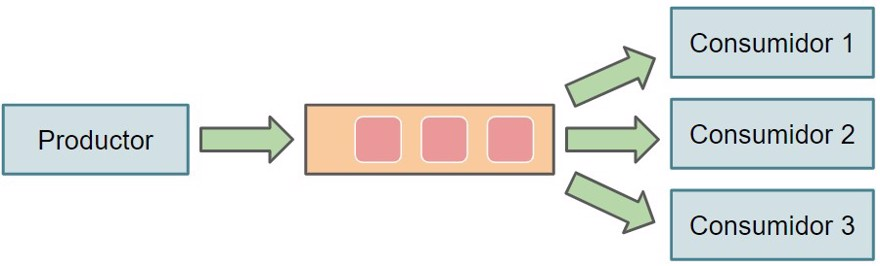
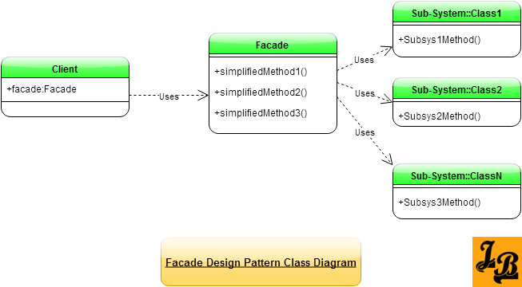
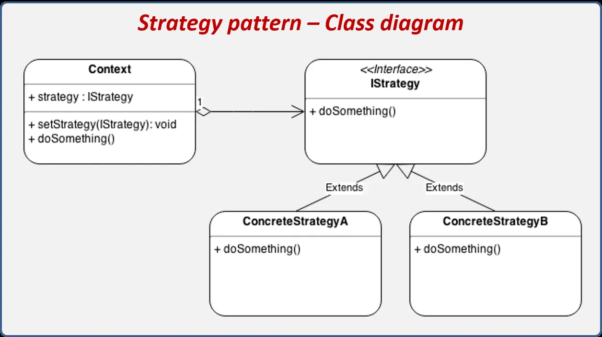
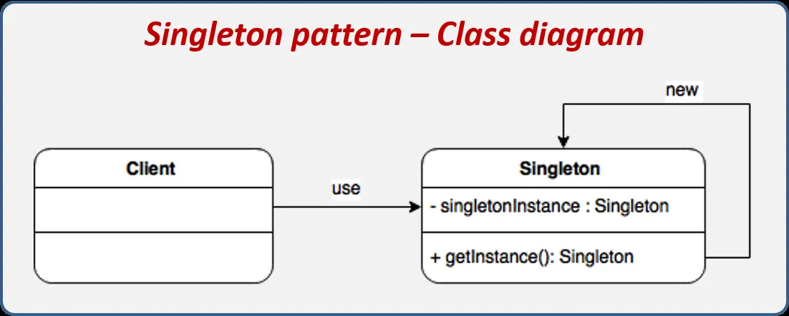

During the design of this platform, various design patterns were applied both for structuring communications between components and for data access and metrics logging. Additionally, throughout development, critical design decisions were made to guarantee system scalability, fault tolerance, and flexibility.

---

## Producer-Consumer

The core pattern of the system is the **producer-consumer pattern**, used in the platform's central APIs: the REST API acts as a producer of blocks in the RabbitMQ queues, while the WebSocket API (to which workers connect) acts as a consumer. This enables proper block distribution, avoiding duplicates and preventing block loss, thus improving system scalability.

## Facade

Another present pattern is the **facade pattern**. This pattern reduces coupling between components and hides the internal logic of underlying subsystems. It was applied to the data access method: all components requiring access to the platform's database go through an intermediate layer responsible for managing the connection pool, queries, and cursors.

## Strategy (retired)

Notably, one of the patterns proposed midway through project development was the **strategy pattern**, applied to the data access layer. This layer was composed of an interface with all the methods to query the database, and provided two different implementations: one for MySQL databases and another for Oracle. This allowed switching between these implementations by modifying a configuration file, avoiding changes to lines of code and enabling runtime modifications.

:::note[Why it was removed]
Due to retrospective considerations, this component was removed once the migration to Oracle was successfully completed. With Oracle established as the sole database engine (necessary to leverage its *Blockchain Tables*, see [Data Model](../modelo-de-datos/)), maintaining an abstraction layer for an alternative engine that would no longer be used added complexity without delivering real value.
:::

## Singleton

The **singleton pattern** is used for instantiating shared components, such as the rendering console provided by the Rich library, reusing a single global instance.

## Middleware

To obtain information about latency between requests to the main REST API and their responses, the **middleware pattern** was implemented. This allows intercepting HTTP requests during processing to measure the time elapsed between receiving the request and sending the response, centralizing monitoring logic without modifying the implementation of the system's various endpoints.

:::note[And the Observer pattern?]
For retrieving metrics via the Prometheus *exporter*, the Observer pattern is not used, since none of the system's APIs automatically notify of changes or events. Instead, a *polling* mechanism was chosen, making periodic requests at set intervals to collect and update system metrics.
:::

---

## Data Modeling

The platform uses a relational database designed to store information related to users, tasks, task executions, hardware resources, and generated results. The model was designed following decoupling and scalability criteria, allowing new task types to be added without modifying the core system structure.

The most relevant entities are as follows:

* **`account`** — account of the registered users within the platform.
* **`task`** — general definition of a distributed task.
* **`taskstatus`** — contains all states through which a task can transit.
* **`process`** — concrete subdivision of work associated with a task, known as a *process* (see [Glossary](../glosario/)).
* **`execution`** — execution of a given process, performed by a worker.
* **`executionstatus`** — contains all states through which an execution can transit.
* **`file`** — files generated during executions.
* **`resource_metric`** — hardware characteristics unit associated with tasks as execution prerequisites.
* **`resource`** — hardware resources that can be required as a prerequisite.
* **`authprovider`** — contains all OAuth authentication providers.
* **`authlocalcredentials`** — contains all credentials of users who do not use OAuth.
* **`transfer`** — contains all transactions of the system.

The separation between tasks, processes, and executions allows work to be distributed independently among multiple workers and facilitates the implementation of validation and fault tolerance mechanisms. The full entity-relationship schema is detailed in [Data Model](../modelo-de-datos/).
