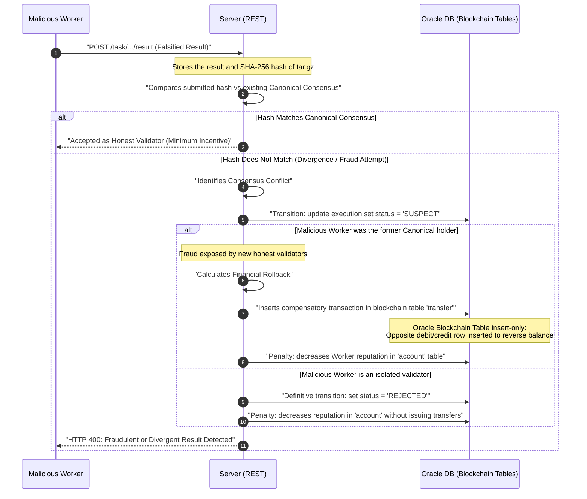

Security in Synergia is managed under the principle of least privilege and "zero trust" toward arbitrary code downloaded from task repositories. This principle applies both to identity validation on the server and to the physical environment isolation on the worker.

---

## Account Authentication

The platform supports two independent methods of authentication and registration resolved in the Oracle database:

### Local Authentication
* **Robust Hashing (Argon2id):** Local passwords are never stored in plaintext or with weak/reversible algorithms. They are processed using **Argon2id** (via `argon2-cffi`), the winner of the *Password Hashing Competition (PHC)*, immune to massive GPU attacks due to its memory-hard configuration.
* **Mandatory Email Verification:** Registering local accounts requires verifying the user's email address. The server generates a single-purpose signed JWT token (`purpose: email_verification`) and sends it via an **SMTP** server. The `/verify-email` endpoint validates the token and activates the flag in the database.
* **Email Domain Restriction:** To mitigate automated creation of fake accounts and reputation fraud (*Sybil attacks*), the REST API validates that the email belongs to a whitelist of permitted domains (by default: `gmail.com`, `outlook.com`, `hotmail.com`, and `udc.es`).

### OAuth 2.0 Authentication (Google and GitHub)
Enables fast registration and login without a local password:
* **Secure Flow (Authorization Code Flow):** The client requests the authorization URL from the server, which generates a random `state` security parameter against CSRF attacks. This `state` is stored in a server in-memory cache with a strict 5-minute time-to-live (TTL) and validated upon receiving the callback.
* **Dual Request for GitHub:** The Google callback directly exchanges the code for the token and reads the email. The GitHub callback addresses user privacy: if the public email is not available in the provider's initial response, it makes a second authenticated and encrypted call to the `/user/emails` endpoint of the GitHub API to retrieve the verified private email.
* **Multi-Provider Accounts:** The relational model allows associating multiple OAuth credentials (e.g., registering with Google and subsequently linking the GitHub account) with a single `account` identifier.

---

## Session Management and JSON Web Tokens (JWT)

Once the user successfully authenticates (locally or via OAuth), the server issues a **JSON Web Token (JWT)** that acts as a session credential:

* **Digital Signature (HS256):** The token is digitally signed with the HMAC SHA-256 symmetric algorithm using the secret key `JWT_SECRET_KEY` configured on the server.
* **Custom Header (`token`):** Unlike the common industry standard that employs the `Authorization: Bearer <JWT>` format, the Synergia REST API deliberately requires sending the token in a custom header named `token` (`token: <JWT_VALUE>`).
* **24-Hour Expiration:** Session validity is exactly 24 hours. After this period, the CLI client will reject local requests, requiring a new login (`synergia login-user`).
* **Subject Identification:** The token payload contains the unique numerical ID of the account in the `sub` field, preventing identity spoofing between users.

---

## Compute Integrity and Security (Summary)

For an in-depth description of execution security policies, refer to the dedicated guide on [Worker Internals and Isolation](../worker-aislamiento/). Key defenses implemented include:

* **Docker Isolation:** All third-party code runs under an unprivileged user (`worker`) and with RAM/CPU limits set via cgroups.
* **iptables Firewall:** All outgoing network communication inside the container is blocked by default. Exceptions are only added for DNS resolutions and for the resolved IP addresses associated with authorized domains in the `[network].allowed_hosts` list.
* **Secure Download Wrappers:** Native download binaries (`curl`/`wget`) are replaced with C executables featuring the setuid bit that log the SHA-256 hash of each download to a read-only log file.
* **Repository Snapshot:** The worker performs an integrity check comparing the combined hash of the code and its downloaded dependencies against the original snapshot registered by the server in the database when the task was published. If hashes differ, execution is automatically aborted.

---

## Operational Scenarios and Technical Validation

To certify the invulnerability of the Synergia orchestrator in real hostile environments, two advanced operational scenarios are defined regulating behavior in the face of fraud and physical failures.

### Scenario C.3: Fraud Detection and Mitigation in Deterministic Tasks

When a malicious volunteer intentionally tampers with the local task code or alters the output binary to submit fake or manipulated results in exchange for easy credits, the orchestrator applies automatic cryptographic mitigation.



#### Database Transitions and Logs
1. **Result Upload POST:** When processing a POST to `/task/{id}/process/{pid}/execution/{eid}/result`, the server saves telemetry and inserts the SHA-256 hash of the output file uploaded by the worker.
2. **Consensus Evaluation:** The database runs a query to determine the number of identical executions for each output hash. If the current worker's execution yields a hash that does not match the established canonical one, the execution status is provisionally marked as `'SUSPECT'` in the `execution` table.

#### Financial Rollback in Blockchain Tables
Since Synergia's financial ledger uses **Oracle Blockchain Tables** (immutable tables designed under an *insert-only* schema that physically prohibits `UPDATE`, `DELETE`, or mutational row locks like `FOR UPDATE`), it is impossible to directly delete or modify a payment record that has turned out to be fraudulent.

To reverse fraud and correct the balance, the orchestrator applies a **compensatory transaction**:
1. Identifies the original transaction ID (`transfer_id`) through which the malicious worker fraudulently received credits.
2. Inserts a new row into the blockchain transfer table (`transfer`) with opposite signs:
   * **Source:** The malicious worker's account (`account_id` of the scammer).
   * **Destination:** The task Publisher's account (original `account_id`).
   * **Amount:** The entirety of the credits previously paid for that block.
3. The blockchain table's cryptographic engine sequentially generates a chained SHA-256 hash signature sealing the compensatory transaction, guaranteeing an unalterable audit trail for security inspectors.

#### Reputation Penalties
The account table (`account`) is updated, reducing the fraudulent worker's reputation by a multiplicative factor of **50%**. If cumulative reputation falls below a **20%** threshold, the account is persistently marked as `'BANNED'`, and the orchestrator denies any future WebSocket requests.

---

### Scenario C.4: Fault Tolerance and Abrupt Connection Drops

This scenario handles the physical disconnection of a node (hardware power outage at the volunteer's machine, sudden network loss, or manual service termination by the user) mid-way through processing a block.

```mermaid
sequenceDiagram
    autonumber
    participant W as Worker (Client)
    participant S as Server (WS / REST)
    participant Q as RabbitMQ (Queues)
    participant DB as Oracle DB

    Note over W: Processing active task (make run)
    Note over W,S: Persistent WebSocket connection active
    W-xS: "Abrupt network disconnection (Lost Heartbeat)"
    
    Note over S: Server detects socket closure (TCP FIN or Timeout)
    S->>S: "Identifies execution IDs assigned to dead socket"
    
    S->>Q: "Returns chunk: aio-pika amqp_message.nack(requeue=True)"
    Note over Q: Chunk returns to head of RabbitMQ queue
    
    S->>DB: "Updates associated executions to status = 'LOST'"
    
    rect rgb(30, 30, 40)
        Note over W: Host recovers (physical reboot)
        W->>W: "Runs orphan initialization routine"
        W->>W: "docker kill and docker rm for orphan synergia-* containers"
        W->>W: "Removes corrupt partial outputs"
    end
```



#### Network Mechanisms and RabbitMQ Lifecycle
1. **Drop Detection:** The WebSocket connection maintains a cross-monitoring flow (*heartbeat* or ping/pong every 10 seconds). If the server receives no activity after 20 seconds, it assumes physical node loss and closes the socket at the TCP layer.
2. **Re-queuing in RabbitMQ (At-Least-Once Guarantee):**
   * The orchestrator locates the AMQP message object provisionally delivered to the dropped worker (which remained in an *unacknowledged* state).
   * Using the asynchronous communication library `aio-pika`, the server calls `message.nack(requeue=True)`.
   * The chunk message is immediately re-added to the head of the RabbitMQ queue to be instantly assigned to the next available worker in the network, avoiding delays in the task's global pipeline.
3. **State Updates:** The backend updates affected records in the `execution` database table from `'RUNNING'` to `'LOST'`.

#### Orphan Process Reconciliation in the Worker
When the volunteer's host machine recovers power or network connectivity, the local worker daemon is automatically started as a `systemd` service.

During startup initialization (before connecting to the orchestrator):
1. **Docker Namespace Cleanup:** The startup script inspects for Docker containers with the system prefix:
   ```bash
   docker ps -a --filter "name=synergia-*" --format '{{.ID}}' | xargs -r docker rm -f
   ```
   This cleanly removes any orphan containers that remained frozen or consuming RAM/GPU.
2. **Corrupt Output Purge:** Temporary `/outputs` folders and half-written downloaded dependency files are deleted locally to prevent hash collisions or corrupt uploads in future runs.
3. **Secure Reconnection:** The local CLI client executes a new secure WebSocket handshake to request a fresh block of work from the network.
