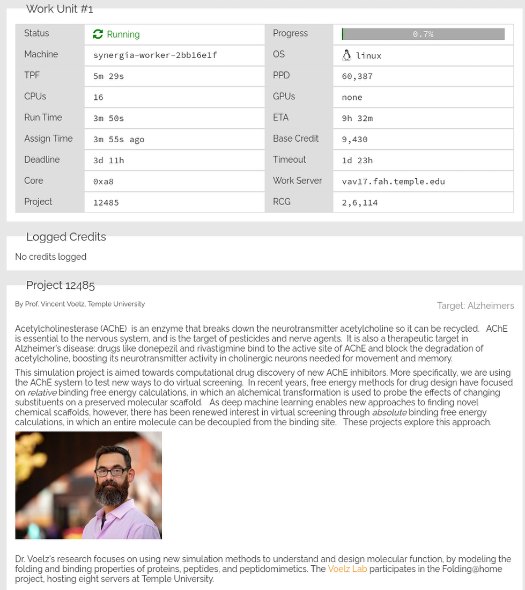
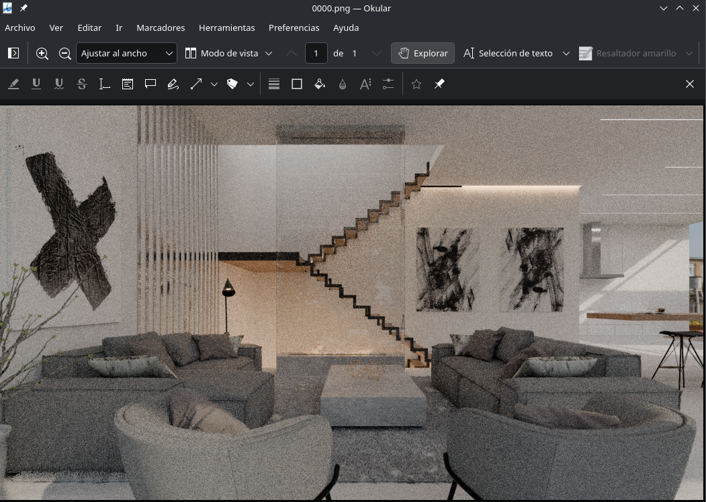

To validate platform capabilities and ease the learning curve for new developers, Synergia provides **six official demonstration repositories**. These examples cover heterogeneous fields such as cryptography, biomedicine, artificial intelligence (LLMs/Vision), and 3D rendering.

Each of these repositories has been tested and executed in a distributed manner across the network, strictly adhering to the [Makefile](../contrato-makefile/) contract and the [config.toml](../config-toml/) manifest format.

---

## yescrypt_task_cracker (Cryptography)

This repository performs a distributed dictionary attack to conduct security audits on **yescrypt** password hashes (the default password scheme in modern distributions such as Debian and Fedora).

### Task `config.toml` File
Uses an optimized `file_single` input type. The large reference password file `rockyou_1k.txt` resides on GitHub, and the worker downloads only the line range assigned to it via `awk` in the container shell, minimizing network and RAM consumption.

```toml
# yescrypt_task_cracker/config.toml (Actual code)
[task]
  deterministic = true

[requirements]
  packages = ["build-essential", "libssl-dev", "john"]  

[inputs]
  type = "file_single"

[inputs.file_single]
  path = "rockyou_1k.txt"
  format = "text"
  delimiter = "\n"

[outputs]
  dir              = "~/.john"
  filename_pattern = "john.pot"
```

### Task `Makefile` File
The Makefile delegates brute force to the **John the Ripper** (`john`) security suite. The `run` target receives the injected parameter `WORDS` (the extracted portion of the dictionary) and performs piped cracking on the hash file:

```makefile
# yescrypt_task_cracker/Makefile (Actual code)
.PHONY: help setup run clean

help:
	@echo ""
	@echo "  make setup                    installs john"
	@echo "  make run WORDS='1234 helloworld passwd'"
	@echo "  make clean                    removes outputs"
	@echo ""

setup:
	@echo "Nothing to install"

run:
	echo $$WORDS | tr ' ' '\n' |  john hashes.txt --stdin --format=crypt

clean:
	rm -rf ~/.john
```

---

## foldingathomesynergia (Biomedicine)

This repository integrates with Stanford University's official **Folding@home** voluntary computing client to contribute to scientific research on protein folding and therapeutic design against molecular diseases.

### Task `config.toml` File
Since stochastic simulations may diverge due to random seeds, `deterministic = false` is defined to disable consensus verification and directly pay the worker for the contributed time. The manifest declares an extensive whitelist of allowed hosts (`allowed_hosts`) so the `iptables` firewall authorizes the Stanford client to connect to scientific assignment servers.

```toml
# foldingathomesynergia/config.toml (Actual code)
[requirements]
packages = ["coreutils", "jq"]
	
[[download.files]]
	url = "https://github.com/vi/websocat/releases/latest/download/websocat.x86_64-unknown-linux-musl"
	dest = "websocat"
	post = "chmod +x websocat"
	
[network]
	allowed_hosts = [
	    "foldingathome.org",
	    "v8-5.foldingathome.org",
	    "app.foldingathome.org",
	    "master.foldingathome.org",
	    "api.foldingathome.org",
	    "api2.foldingathome.org",
	    "api3.foldingathome.org",
	    "api4.foldingathome.org",
	    "api5.foldingathome.org",
	    "assign1.foldingathome.org",
	    "assign2.foldingathome.org",
	    "assign3.foldingathome.org",
	    "assign4.foldingathome.org",
	    "assign5.foldingathome.org",
	    "assign6.foldingathome.org",
	    "cores.foldingathome.org",
	    "cores2.foldingathome.org",
	    "node1.foldingathome.org",
	    "vav17.fah.temple.edu",
	    "vav18.fah.temple.edu",
	    "vav19.fah.temple.edu",
	    "vav20.fah.temple.edu",
	    "vav21.fah.temple.edu",
	    "vav22.fah.temple.edu",
	    "vav23.fah.temple.edu",
	    "vav24.fah.temple.edu",
	    "highland1.seas.upenn.edu",
	    "highland2.seas.upenn.edu",
	    "highland3.seas.upenn.edu",
	    "highland4.seas.upenn.edu",
	    "highland5.seas.upenn.edu",
	]

[outputs]
	dir = "work"

[hash]
    exclude = ["fah", "client.db"]
```

### Task `Makefile` File
The Folding@home Makefile implements advanced orchestration using the `websocat` socket utility:
1. Generates a random volunteer machine ID using `/proc/sys/kernel/random/uuid`.
2. Launches the `fah-client` daemon in the background assigning autodetected host threads (`nproc`).
3. Sends JSON commands via local WebSocket to the Folding control panel (`ws://127.0.0.1:7396`) to unpause computation (`unpause`) and mark the simulation to stop cleanly upon finishing the current work unit (`finish`).
4. Sleeps for 5 minutes (`sleep 300`) while molecular folding takes place, and finally calls `control_upload.sh` to package generated scientific metrics into the outputs directory.

```makefile
# foldingathomesynergia/Makefile (Actual code)
.PHONY: setup run clean

setup:
	@echo "=== Setup Folding@home ==="
	sh setup_fah.sh

run:
	@echo "=== Running Folding@home ==="
	$(eval UUID := $(shell cat /proc/sys/kernel/random/uuid | tr -d '-' | head -c 8))
	fah/usr/bin/fah-client --user=worker --team=1067987 --account-token=E-qC3E-qZgQvAZgeQhxp-QhmGIGNGGIDtDKLztDDt4E --machine-name=synergia-worker-$(UUID) --cpus=$(shell nproc) &
	sleep 10
	echo '{"cmd":"unpause"}' | ./websocat ws://127.0.0.1:7396/api/websocket
	echo '{"cmd":"finish"}' | ./websocat ws://127.0.0.1:7396/api/websocket
	sleep 300
	./control_upload.sh

 clean:
	rm -f gpus.json log.txt
	rm -rf cores work
```



---

## blender-render-task (3D Rendering)

This repository distributes rendering of heavy 3D animations (such as the official Blender 4.1 Splash scene) frame by frame among multiple concurrent workers across the network.

### Task `config.toml` File
Configured as deterministic (`deterministic = true`). Each block receives a `range_continuous` numerical range defining the start and end frame to render. The container automatically downloads the scene's `.blend` file and the Linux-optimized Blender binary engine unattended from official releases.

```toml
# blender-render-task/config.toml (Actual code)
[requirements]
packages = ["curl", "xz-utils", "libsm6", "libxext6", "libxrender1", "libxi6", "libxkbcommon0", "libgl1", "libegl1", "libxcursor1", "libxfixes3", "libxinerama1", "libxrandr2", "libegl-mesa0"]

[inputs]
type = "range_continuous"

[[download.files]]
url  = "https://github.com/yagomilenio/blender-render-task/releases/download/1.0/blender-4.1-splash.blend"
dest = "blender-4.1-splash.blend"

[[download.files]]
url  = "https://github.com/yagomilenio/blender-render-task/releases/download/1.0/blender-5.1.0-linux-x64.tar.xz"
dest = "blender-5.1.0-linux-x64.tar.xz"
 
[inputs.range_continuous]
start = 1
end   = 250   
step  = 1
 
[outputs]
dir              = "outputs"
filename_pattern = "frames_{start}_{end}.tar.gz"
```

### Task `Makefile` File
The Blender Makefile extracts the Blender tarball in the `setup` phase and delegates rendering execution to the internal `render.sh` script, passing the `START` and `END` parameters:

```makefile
# blender-render-task/Makefile (Actual code)
START  ?= 1
END    ?= 10
BLEND  ?= $(shell ls *.blend 2>/dev/null | head -1)
OUTPUT ?= outputs/frames_$(START)_$(END).tar.gz

.PHONY: help setup run test clean

help:
	@echo ""
	@echo "  make setup                    installs Blender"
	@echo "  make run START=1 END=50       renders frames 1-50"
	@echo "  make test                     quick test (frames 1-3)"
	@echo "  make clean                    removes outputs"
	@echo ""

setup:
	tar -xf blender-5.1.0-linux-x64.tar.xz

run:
	bash render.sh --start $(START) --end $(END) --output $(OUTPUT)

test:
	bash render.sh --start 1 --end 3 --output outputs/test

clean:
	rm -rf outputs
```



---

## testRepositoryForParallel (Minimal Reference)

* **Purpose:** Minimalist reference repository designed to test container initialization, range injection, cross-verification, and worker packaging.
* **Key Structure:**
  * `config.toml` configured as deterministic with `range_continuous` input (0 to 100, step 10).
  * `Makefile` producing simple text outputs concatenating `START` and `END` variables.

---

## ollama-llm-task (LLM Inference / Dynamic)

* **Purpose:** Large-scale distributed local inference using lightweight natural language AI models (such as `llama3`, `gemma`, or `phi3`) via asynchronous calls to the local **Ollama** suite.
* **Operational Mechanics:**
  * Configured as `dynamic` input type. Has no predefined bounds; receives prompts live from the database injected by the publisher and processes them one by one by injecting the string into the `WORD` environment variable in `make run`.

---

## qwen2-vl-7b-parallel-test (Vision Inference)

* **Purpose:** Parallel distributed computer vision inference and multimodal transcription using the frontier Deep Learning model **Qwen2-VL 7B** over a set of input images.
* **Operational Mechanics:**
  * The `setup` target configures the virtual environment, installs heavy libraries (`torch`, `transformers`, `accelerate`), and downloads AI model weights.
  * The `run` target executes the `run_vision.py` inference script, exclusively leveraging GPU hardware acceleration (`--gpus`) and pinned CPU threads (`--cpuset-cpus`) declared on your node.
